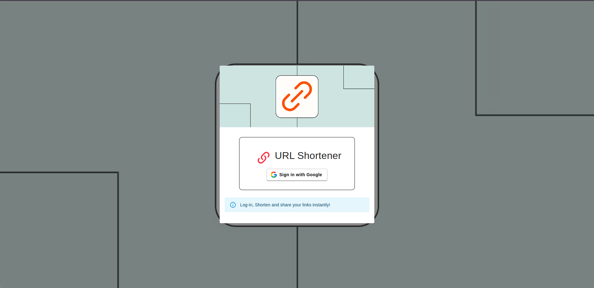
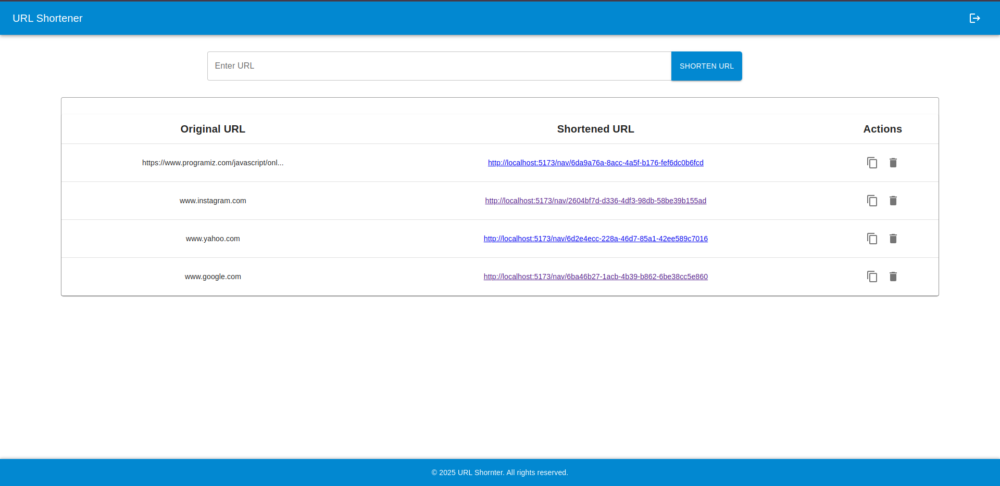

# URL Shortener

This is a full-stack URL Shortener application built using the MERN (MongoDB, Express.js, React, Node.js) stack. It allows users to shorten long URLs, manage their shortened links, and authenticate using Google SSO.

## Features

- Shorten long URLs
- Redirect to original URL using the shortened version
- Copy shortened URLs to clipboard
- Google Sign-In for authentication
- View and delete previously shortened URLs

## Screenshots

### Login Page


### Home Page


## Technologies Used

### Frontend
- React
- Material-UI
- React Router
- Axios

### Backend
- Node.js
- Express.js
- MongoDB & Mongoose
- Passport.js (Google OAuth)
- Cors & Cookie-Session

## Setup

### Prerequisites
- Node.js & npm
- MongoDB (local or cloud)

### Installation

#### 1. Clone the repository
```sh
git clone https://github.com/kumaranhk/urlShortner.git
```

#### 2. Backend Setup
```sh
cd url-shortener/server
npm install
```

Create a `.env` file in the `backend` directory:
```sh
touch .env
nano .env
```
Add the following variables:
```env
    GOOGLE_CLIENT_ID=your_google_client_id
    GOOGLE_CLIENT_SECRET=your_google_client_secret
    SESSION_SECRET=your_session_secret
    FRONTEND_URL=your_frontend_url
    GOOGLE_CALLBACK_URL=your_google_callback_url
    PORT=4000
    SERVER_URL=backend_url
    NODE_ENV=production || dev
    MONGOOSE_URI=mongodb://127.0.0.1:27017/your_db_name
```

Start the backend server:
```sh
npm start
```

#### 3. Frontend Setup
```sh
cd ../client
npm install
```

Create a `.env` file in the `frontend` directory:
```sh
touch .env
nano .env
```
Add the following:
```env
VITE_BACKEND_URL=http://localhost:4000
```

Start the frontend server:
```sh
npm run dev
```
